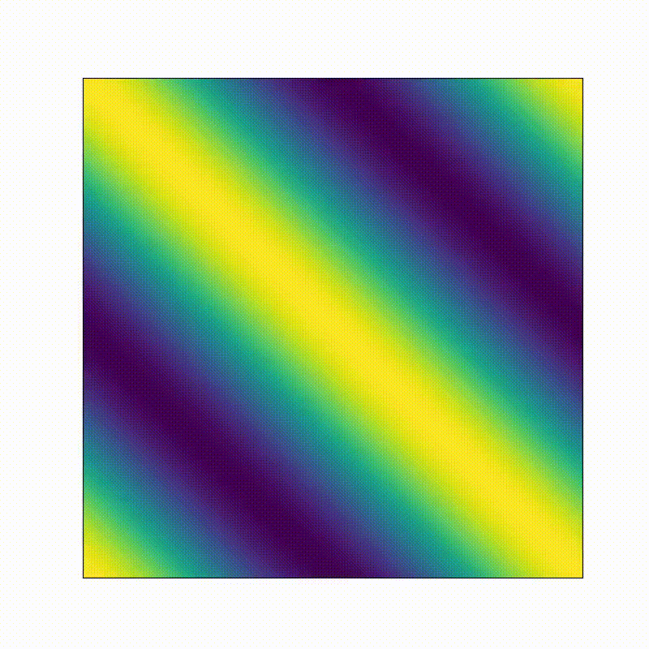

# About
Solving the 3D heat equation  with a finite difference method. The computatinal domain is a cube with the size of . Animation shows the simulation results.
 

At the simulation results are compared with the analytical solution for sanity check.
The difference `L2_norm` will be printed out in the standard output.

# Numerical settings
## Boundary conditions
We apply preidoic boundary conditions in each direction as 
- =u(L,y,z,t)) 
- =u(x,L,z,t))  
- =u(x,y,L,t))   

## Initial condition
In order to compare with the analytical solution, we apply the following initial condition:  
=\cos(2\pi(x/L+y/L+z/L))) 

## Analytical solution
With the boundary and initial conditions given above, we have the analytical solution as
=\cos(2\pi(x/L+y/L+z/L))\exp(-3\kappa*(2\pi/L)^2t).)  
The numerical solution is checked against this solution.

# Parallelization

# Run
## heat3d
You can set the problem size (resolution), the number of iteration and the frequency of diagnostics.  
- `nx`: The number of grid points in x direction. (default: 128)  
- `ny`: The number of grid points in y direction. (default: 128)    
- `nz`: The number of grid points in z direction. (default: 128)  
- `nbiter`: The number of iterations of simulations. (default: 1000)  
- `freq_diag`: The diagnostics is made for every `freq_diag` step. (default: 10)

## heat3d_mpi
You can set the problem size (resolution), the MPI domain decomposition, the number of iteration and the frequency of diagnostics.  
- `nx`: The number of grid points in x direction. (default: 128)  
- `ny`: The number of grid points in y direction. (default: 128)    
- `nz`: The number of grid points in z direction. (default: 128)  
- `px`: The number of MPI processes in x direction. (default: 2)  
- `py`: The number of MPI processes in y direction. (default: 2)    
- `pz`: The number of MPI processes in z direction. (default: 2)  
- `nbiter`: The number of iterations of simulations. (default: 1000)  
- `freq_diag`: The diagnostics is made for every `freq_diag` step. (default: 10)

It should be noted that the total MPI processes `nb_procs` must be eqaul to `px * py * pz`.
If we set `px = 1`, then MPI communication along x direction is suppressed and replaced by swapping halo regions. 
