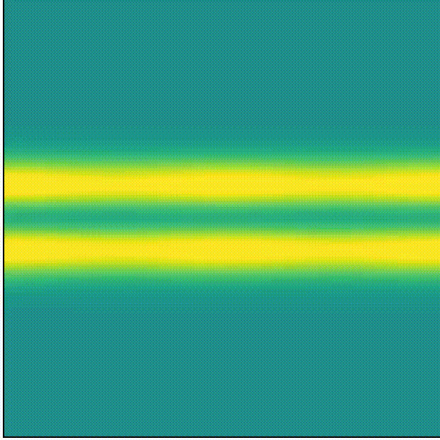

# vlp4d code

## Brief description
The vlp4d code solves Vlasov-Poisson equations in 4D (2D space and 2D velocity space). 
From the numerical point of view, vlp4d is based on a semi-lagrangian scheme. 
Vlasov solver is typically based on a directional Strang splitting. The Poisson equation is treated with 2D Fourier transforms. 
For the sake of simplicity, all directions are, for the moment, handled with periodic boundary conditions. 
We have prepared the non-MPI and MPI versions, where the non-MPI version uses the Lagrange interpolation and MPI version uses the Spline interpolation. 

. 

Detailed descriptions of the test cases can be found in 
- [Crouseilles & al. J. Comput. Phys., 228, pp. 1429-1446, (2009).](http://people.rennes.inria.fr/Nicolas.Crouseilles/loss4D.pdf)  
  Section 5.3.1 Two-dimensional Landau damping -> SLD10
- [Crouseilles & al. Communications in Nonlinear Science and Numerical Simulation, pp 94-99, 13, (2008).](http://people.rennes.inria.fr/Nicolas.Crouseilles/cgls2.pdf)  
  Section 2 and 3 Two stream Instability and Beam focusing pb -> TSI20
- [Crouseilles & al. Beam Dynamics Newsletter no 41 (2006).](http://icfa-bd.kek.jp/Newsletter41.pdf )  
  Section 3.3, Beam focusing pb.
  
Detailed descriptions for the HPC aspect can be found in 
- [Y. Asahi, et al, Accelerator Programming Using Directives, 2019.](https://link.springer.com/chapter/10.1007/978-3-030-49943-3_6).  
  Implementation of vlp4d in OpenACC and Kokkos.
- [Y. Asahi, et al, 2021 International Workshop on Performance, Portability and Productivity in HPC (P3HPC), 2021.](https://ieeexplore.ieee.org/document/9652841).   
  Optimization strategy of vlp4d_mpi in MPI+OpenACC and MPI+Kokkos.
  
# Numerical settings
## Boundary conditions
For the sake of simplicity, all directions are, for the moment, handled with periodic boundary conditions. The Poisson equation is treated with 2D Fourier transforms. Vlasov equation is solved with a semi-Lagrangian scheme.

## Time integration scheme
### vlp4d
In the non-MPI version, the 4D advection operator is split into four 1D operators with Lagrangian interpolation. The time integration scheme is as follows.

- 1D advection along )
- 1D advection along )
- Poisson solver: compute electric fields  and 
- 1D advection along )
- 1D advection along )
- 1D advection along )
- 1D advection along )

### vlp4d_mpi
In the MPI version, the 4D advection operator is solved with Spline interpolation. The time integration scheme is as follows.
- Halo excahnge on  (P2P communications)  
- Compute spline coefficient along ) directions
- 2D advection along )
- Poisson solver: compute electric fields  and 
- Compute spline coefficient along ) directions
- 4D advection along ) directions for 
  
# Parallelization
`vlp4d` is parallelized with _stdpar_, OpenMP, OpenACC, OpenMP4.5, Kokkos, Thrust, CUDA and HIP. 

# Run
## Input file
Numerical and physical parameters are set from the input file. Here is an example of the input file [SLD10_large.dat](https://github.com/yasahi-hpc/P3-miniapps/blob/main/wk/SLD10_large.dat).
```
** Definition of mesh
Number of points in Ex with the coarse mesh : 128
Number of points in Ey with the coarse mesh : 128
Number of points in Vx with the coarse mesh : 128
Number of points in Vy with the coarse mesh : 128

** Defintion of the geometry of the domain
Minimal value of Ex : 0.
Maximal value of Ex : 12.56637112
Minimal value of Ey : 0.
Maximal value of Ey : 12.56637112

Minimal value of Vx : -9.
Maximal value of Vx :  9.
Minimal value of Vy : -9.
Maximal value of Vy :  9.

** Considered test cases
 -10- Landau Damping
 -11- Landau Damping 2
 -20- Two beam instability
Number of the chosen test case : 10

** Iterations in time and diagnostics
Time step : 0.125
Number of total iterations : 128
Frequency of diagnostics : 8
Diagnostics of fxvx : 0
```
The numbers just after `:` are considered as the input parameters. 
For the moment, the input file must be strictly in this format (no changes to the orders, the number of variables). 
We mostly change the number of points, time step size and the test case number. For example, we have executed with the input file [TSI20.dat](https://github.com/yasahi-hpc/P3-miniapps/blob/main/wk/TSI20.dat) to make the animation.

## vlp4d
The sourcde codes for each programming model are placed under `miniapps/vlp4d` directory.
```
---/
 |
 └──vlp4d/
    |--kokkos/
    |--openacc/
    |--openmp/
    |--stdpar/
    |--thrust/
    |--CMakeLists.txt
    └──timer.hpp
```

### Example Compile Command (with stdpar for Nvidia GPUs)
```bash
mkdir build && cd build
cmake -DCMAKE_CXX_COMPILER=nvc++ -DCMAKE_BUILD_TYPE=Release -DPROGRAMMING_MODEL=STDPAR -DBACKEND=CUDA -DAPPLICATION=vlp4d ..
cmake --build .
```

### Example Run Command
```./vlp4d SLD10_large.dat```

### Expected output (stdout)
If the code works appropriately, 
you will get the following performance results (performed on A100 GPU) at the bottom of the standard output file.
```
total 4.78412 [s], 1 calls
MainLoop 4.77905 [s], 128 calls
advec1D_x 0.955611 [s], 256 calls
advec1D_y 1.71972 [s], 256 calls
advec1D_vx 0.839491 [s], 128 calls
advec1D_vy 0.9146 [s], 128 calls
field 0.303187 [s], 128 calls
Fourier 0.0381166 [s], 128 calls
diag 0.00820169 [s], 128 calls
```
Each column denotes the kernel name, total elapsed time in seconds, and the number of call counts. 

## vlp4d_mpi
The sourcde codes for each programming model are found under `miniapps/vlp4d_mpi` directory.
```
---/
 |
 └──vlp4d_mpi/
    |--kokkos/
    |--openacc/
    |--openmp/
    |--stdpar/
    |--thrust/
    |--CMakeLists.txt 
    |--Parser.hpp
    └──Timer.hpp
```

### Example Compile Command (with stdpar for Nvidia GPUs)
```bash
mkdir build && cd build
cmake -DCMAKE_CXX_COMPILER=nvc++ -DCMAKE_BUILD_TYPE=Release -DPROGRAMMING_MODEL=STDPAR -DBACKEND=CUDA -DAPPLICATION=vlp4d_mpi ..
cmake --build .
```

### Example Run Command
```./wrapper.sh ./vlp4d_mpi --num_threads 1 --teams 1 --device 0 --num_gpus 8 --device_map 1 -f SLD10.dat```. 
For stdpar, the MPI process mapping to GPUs should be made before running the application. The wrapper script ```wrapper.sh``` for [OpenMPI](https://www.open-mpi.org) is as follows. 
```bash
#!/bin/sh

NGPUS=`nvidia-smi -L | wc -l`
export CUDA_VISIBLE_DEVICES=$((OMPI_COMM_WORLD_LOCAL_RANK % NGPUS))
exec $*
```

### Expected output (stdout)
If the code works appropriately, 
you will get the following performance results (performed on A100 GPU) at the bottom of the standard output file.
```
total 4.55461 [s], 1 calls
MainLoop 4.51995 [s], 40 calls
pack 0.122992 [s], 40 calls
comm 0.037724 [s], 40 calls
unpack 0.061194 [s], 40 calls
advec2D 0.362362 [s], 40 calls
advec4D 1.36502 [s], 40 calls
field 0.148563 [s], 80 calls
all_reduce 0.13413 [s], 80 calls
Fourier 0.0268526 [s], 80 calls
diag 0.0541387 [s], 80 calls
splinecoeff_xy 0.797317 [s], 40 calls
splinecoeff_vxvy 1.25026 [s], 40 calls
```
Each column denotes the kernel name, total elapsed time in seconds, and the number of call counts. 
